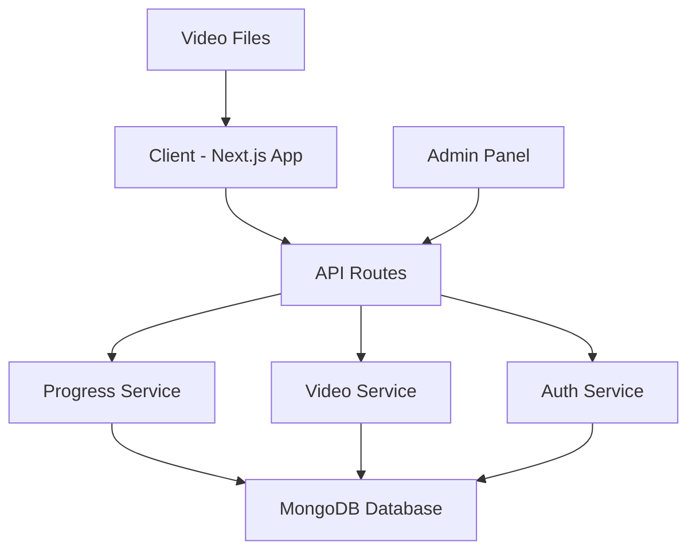

# Video Progression System Design

## Overview

The Video Progression System is a comprehensive solution that manages sequential video access for a learning platform while consolidating the duplicate Next.js structure. The system tracks user progress, enforces video unlock sequences, and provides administrative controls for content management.

## Architecture

### High-Level Architecture



### Data Flow

1. **User Authentication**: Users authenticate through existing auth system
2. **Progress Tracking**: Real-time progress updates sent to backend every 10 seconds
3. **Unlock Logic**: Server validates completion status before allowing video access
4. **State Management**: Client maintains current video state and sync with server

## Components and Interfaces

### Backend Components

#### 1. Progress Service (`/src/lib/services/progressService.ts`)
```typescript
interface VideoProgress {
  userId: string;
  videoId: string;
  currentTime: number;
  duration: number;
  completed: boolean;
  completedAt?: Date;
  lastWatched: Date;
}

interface ProgressService {
  updateProgress(userId: string, videoId: string, progress: VideoProgress): Promise<void>;
  getProgress(userId: string, videoId: string): Promise<VideoProgress | null>;
  getUserProgress(userId: string): Promise<VideoProgress[]>;
  markCompleted(userId: string, videoId: string): Promise<void>;
  resetProgress(userId: string, videoId?: string): Promise<void>;
}
```

#### 2. Video Service (`/src/lib/services/videoService.ts`)
```typescript
interface VideoMetadata {
  id: string;
  title: string;
  description: string;
  filePath: string;
  week: number;
  exercise: number;
  order: number;
  prerequisiteVideoId?: string;
}

interface VideoService {
  getVideoMetadata(videoId: string): Promise<VideoMetadata>;
  getAvailableVideos(userId: string): Promise<VideoMetadata[]>;
  isVideoUnlocked(userId: string, videoId: string): Promise<boolean>;
  getVideoSequence(): Promise<VideoMetadata[]>;
}
```

### Frontend Components

#### 1. Video Player Component (`/src/components/VideoPlayer.tsx`)
- Custom video player with progress tracking
- Lock overlay for inaccessible videos
- Resume functionality for partially watched videos
- Progress bar and completion indicators

#### 2. Video Progress Hook (`/src/hooks/useVideoProgress.ts`)
- Manages video progress state
- Handles automatic progress updates
- Syncs with backend API
- Manages unlock status

### API Routes

#### 1. Progress API (`/src/app/api/progress/route.ts`)
- `GET /api/progress/:userId` - Get user's complete progress
- `POST /api/progress/update` - Update video progress
- `POST /api/progress/complete` - Mark video as completed
- `DELETE /api/progress/reset` - Reset user progress

#### 2. Video API (`/src/app/api/videos/route.ts`)
- `GET /api/videos/available/:userId` - Get unlocked videos for user
- `GET /api/videos/metadata/:videoId` - Get video metadata
- `GET /api/videos/unlock-status/:userId/:videoId` - Check if video is unlocked

#### 3. Admin API (`/src/app/api/admin/videos/route.ts`)
- `GET /api/admin/progress` - Get all users' progress
- `POST /api/admin/unlock` - Manually unlock video for user
- `POST /api/admin/reset-progress` - Reset user progress
- `GET /api/admin/analytics` - Get completion analytics

## Data Models

### MongoDB Collections

#### 1. VideoProgress Collection
```typescript
{
  _id: ObjectId,
  userId: string,
  videoId: string,
  currentTime: number,
  duration: number,
  completed: boolean,
  completedAt?: Date,
  lastWatched: Date,
  createdAt: Date,
  updatedAt: Date
}
```

#### 2. VideoMetadata Collection
```typescript
{
  _id: ObjectId,
  videoId: string,
  title: string,
  description: string,
  filePath: string,
  week: number,
  exercise: number,
  order: number,
  prerequisiteVideoId?: string,
  isIntroVideo: boolean,
  createdAt: Date,
  updatedAt: Date
}
```

### Video Sequence Configuration
```typescript
const VIDEO_SEQUENCE = [
  {
    videoId: 'intro-video',
    title: 'Introduction Video',
    filePath: '/assets/videos/Intro Video.mp4',
    week: 0,
    exercise: 0,
    order: 0,
    isIntroVideo: true
  },
  {
    videoId: 'week-1-exercise-1',
    title: 'Session 1 - Exercise 1, Part 2',
    filePath: '/assets/videos/Session 1 - excercise 1, part 2 final.mp4',
    week: 1,
    exercise: 1,
    order: 1,
    prerequisiteVideoId: 'intro-video'
  },
  // ... additional videos
];
```

## Error Handling

### Client-Side Error Handling
- Network connectivity issues during progress updates
- Video loading failures
- Authentication token expiration
- Graceful degradation when backend is unavailable

### Server-Side Error Handling
- Database connection failures
- Invalid user/video ID validation
- Progress update conflicts
- File system access errors for video files

### Error Response Format
```typescript
interface ApiError {
  success: false;
  error: {
    code: string;
    message: string;
    details?: any;
  };
}
```

## Testing Strategy

### Unit Tests
- Progress service logic validation
- Video unlock algorithm testing
- API route input validation
- Database operation mocking

### Integration Tests
- End-to-end video progression flow
- Progress persistence across sessions
- Admin functionality validation
- Authentication integration

### Performance Tests
- Video loading performance
- Progress update frequency optimization
- Database query performance
- Concurrent user handling

## File Structure Consolidation

### Current Duplicate Structure Issue
```
├── src/                    # Main application
│   ├── app/
│   ├── components/
│   └── lib/
└── nextjs-app/            # Duplicate structure (to be removed)
    └── src/
        ├── app/
        └── components/
```

### Target Consolidated Structure
```
├── src/
│   ├── app/
│   │   ├── api/
│   │   │   ├── progress/
│   │   │   ├── videos/
│   │   │   └── admin/
│   │   ├── weeks/
│   │   └── admin/
│   ├── components/
│   │   ├── VideoPlayer.tsx
│   │   └── ProgressTracker.tsx
│   ├── lib/
│   │   ├── services/
│   │   ├── models/
│   │   └── utils/
│   └── hooks/
│       └── useVideoProgress.ts
```

## Security Considerations

### Authentication & Authorization
- User authentication required for all video access
- Admin role verification for administrative functions
- JWT token validation on all API requests

### Data Protection
- User progress data encryption at rest
- Secure video file access controls
- Rate limiting on progress update endpoints

### Video Content Protection
- Server-side video unlock validation
- Prevent direct file access bypassing unlock logic
- Secure video streaming implementation

## Performance Optimizations

### Video Delivery
- Video file compression and optimization
- Progressive loading for large video files
- CDN integration for video asset delivery

### Progress Tracking
- Debounced progress updates to reduce API calls
- Local storage caching for offline capability
- Batch progress updates for multiple videos

### Database Optimization
- Indexed queries on userId and videoId
- Connection pooling for concurrent users
- Caching frequently accessed video metadata